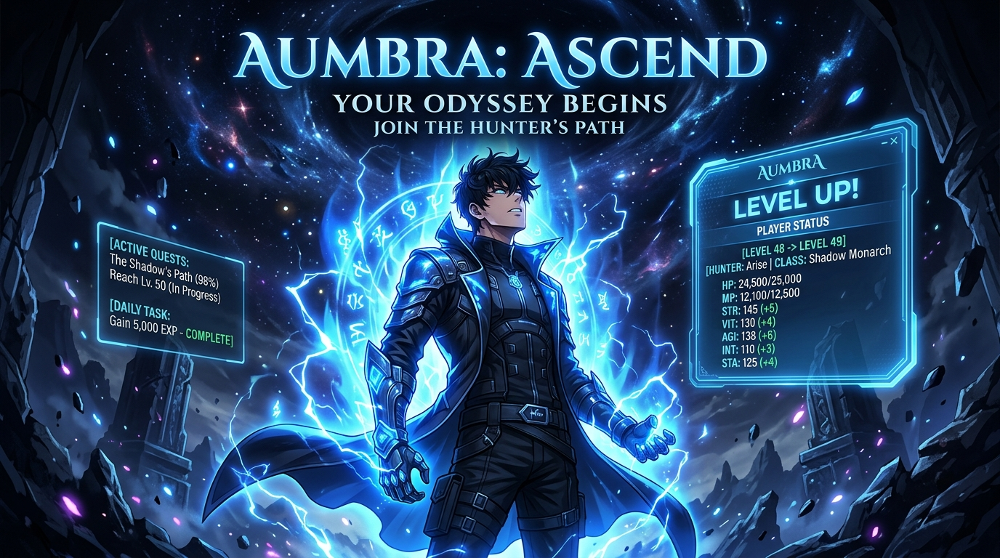

<div align="center">



# ⚔️ Aumbra
### Awaken Your Destiny — Solo Leveling Inspired Self-Improvement RPG

[](https://flutter.dev)
[](https://dart.dev)
[](https://firebase.google.com)
[](https://ai.google.dev/)
[](LICENSE)

<p align="center">
  Transform your daily habits, workouts, and self-discipline into an epic Hunter leveling journey. Aumbra gamifies personal development through dynamic quest systems, AI-powered mentor feedback, stat progression, and a dark Solo Leveling aesthetic.
</p>

</div>

---

## 🌟 Key Features

- 📜 **Daily Hunter Quest System**: Turn real-life daily goals (fitness, coding, reading, mindfulness) into XP-rewarding quests.
- ⚡ **Real-Time Stat Progression**: Level up core attributes (**STR**, **AGI**, **INT**, **VIT**, **STA**) as you complete habits and maintain streaks.
- 🤖 **Gemini AI Quest Master**: Intelligent feedback, quest generation, and personalized motivational dialogue powered by Google Generative AI.
- 📊 **Visual Growth Analytics**: Track XP momentum, level trends, and completion consistency with animated `fl_chart` dashboards.
- ☁️ **Cloud Sync & Offline Persistence**: Firebase Cloud Firestore sync paired with local SQLite offline caching.
- 👑 **Hunter Rank & Awakening Milestones**: Advance from E-Rank novice to S-Rank Shadow Monarch as you conquer your daily objectives.

---

## 🛠️ Tech Stack & Architecture

- **Frontend & Mobile**: [Flutter](https://flutter.dev) (Dart 3.x)
- **State Management**: `provider`
- **Backend & Cloud**: Firebase (Auth, Cloud Firestore)
- **Local Database**: SQLite (`sqflite`), `shared_preferences`
- **AI Engine**: `google_generative_ai` (Gemini Pro)
- **Data Visualization**: `fl_chart`
- **UI System**: Custom Dark Hunter HUD, Google Fonts (`Outfit`), custom neon animations

---

## 🚀 Getting Started

### Prerequisites
- [Flutter SDK](https://docs.flutter.dev/get-started/install) (`>= 3.2.0`)
- A [Firebase Project](https://console.firebase.google.com/) configured for Flutter
- Google Gemini API Key

### Installation

```bash
# 1. Clone repository
git clone https://github.com/Knecrow/Aumbra.git
cd Aumbra

# 2. Install dependencies
flutter pub get

# 3. Configure Firebase & AI
# Place your google-services.json (Android) / GoogleService-Info.plist (iOS)

# 4. Launch the application
flutter run
```

---

## 📄 License
This project is licensed under the MIT License - see the `LICENSE` file for details.
